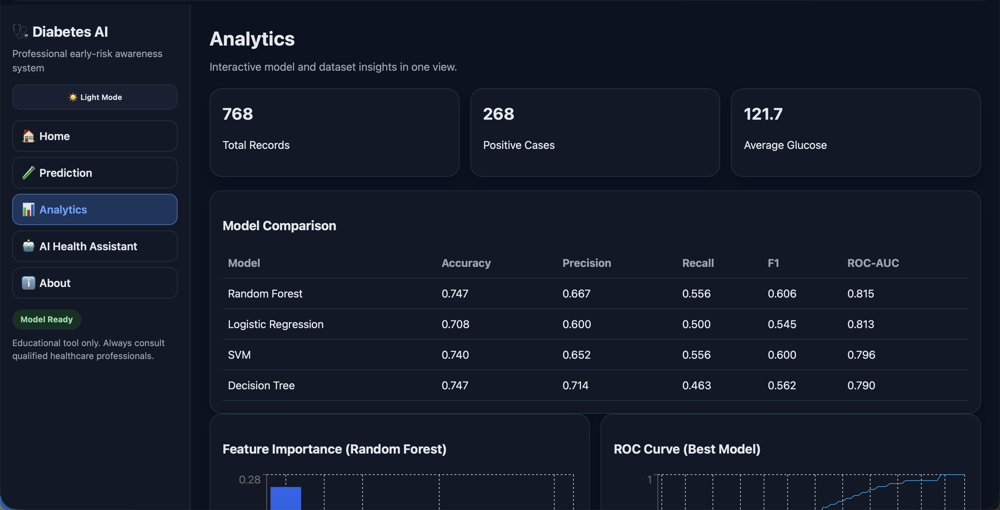

# 🩺 Diabetes AI — Risk Prediction & Health Assistant


An AI-powered web application for diabetes risk prediction and health awareness, built with **React, FastAPI, and Machine Learning**.

> ⚠️ **Medical Disclaimer:** This project is intended for educational and health-awareness purposes only. It does not provide a medical diagnosis or replace professional medical advice.

## 🚀 Overview

Diabetes AI analyzes health parameters and uses machine learning to estimate diabetes risk.

### Key Features

- 🧠 Machine learning-based diabetes risk prediction
- 📊 Interactive analytics dashboard
- 📈 Model comparison and evaluation
- 🔍 Feature importance analysis
- 🤖 AI-powered health assistant
- 📝 Prediction history
- 📁 CSV export
- ⚡ FastAPI REST APIs
- 💻 Responsive React frontend

The system is trained using the **PIMA Indians Diabetes Dataset** and compares multiple machine learning algorithms using metrics such as **ROC-AUC**.

## ✨ How It Works

1. User enters health parameters.
2. React frontend sends the data to the FastAPI backend.
3. The trained ML model processes the input.
4. The system calculates the predicted probability.
5. A risk category is generated:
   - **Low**
   - **Moderate**
   - **High**
6. Results are displayed through the web dashboard.

## 🧠 Machine Learning

The project compares multiple classification models:

| Model | Accuracy | ROC-AUC |
|---|---:|---:|
| Random Forest | 74.68% | **81.50%** |
| Decision Tree | 74.68% | 79.05% |
| SVM | 74.03% | 79.64% |
| Logistic Regression | 70.78% | 81.30% |

**Random Forest** achieved the highest ROC-AUC score among the evaluated models and is used as the primary prediction model.

> These metrics are based on the project's existing evaluation artifacts and should not be interpreted as clinical performance.

## 📊 Analytics Dashboard

The dashboard provides:

- Model performance comparison
- Feature importance
- ROC curve
- Confusion matrix
- Dataset statistics
- Prediction history
- Prediction data export

## 🤖 AI Health Assistant

The application includes an AI-powered assistant for general health education.

It is designed to:

- Provide general health information
- Explain health-related concepts
- Answer educational questions
- Provide appropriate safety guidance

The assistant does **not** diagnose medical conditions or prescribe medication.

## 🛠️ Tech Stack

### Frontend
- React
- Vite
- React Router
- Recharts
- Axios

### Backend
- FastAPI
- Pydantic
- Uvicorn

### Machine Learning
- Scikit-learn
- Pandas
- NumPy
- Joblib

### Visualization
- Matplotlib
- Plotly

### AI Assistant
- Gemini API
- OpenAI API support

## 🏗️ System Architecture

```text
                   ┌────────────────────┐
                   │   React Frontend   │
                   │  Vite + Recharts   │
                   └─────────┬──────────┘
                             │
                         REST API
                             │
                             ▼
                   ┌────────────────────┐
                   │    FastAPI         │
                   │     Backend        │
                   └─────────┬──────────┘
                             │
              ┌──────────────┼──────────────┐
              ▼              ▼              ▼
       ┌────────────┐ ┌────────────┐ ┌─────────────┐
       │ ML Model   │ │ Analytics  │ │ AI Assistant│
       │ Prediction │ │ & History  │ │   Chatbot   │
       └────────────┘ └────────────┘ └─────────────┘